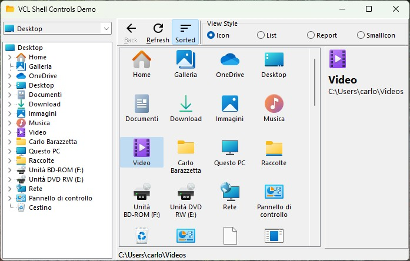

# Shell Controls Packages and Utils 

**Latest Version 1.0.0 - 26 May 2023**

** Packages, demo and Utility of Delphi ShellControl Components (missing by Embarcadero)

Delphi version supported: XE6, XE8, XE10, D10.1, D10.2, D10.3, D10.4, D11

Vcl.Shell.ShellCtrls.pas and Vcl.Shell.ShellConsts.pas are not distributed here, because they are distributed by Embarcadero!

## Installation Notes ##

- Open the Vcl.Shell.Controls.groupproj file from Packages\[DelphiVersion] folder.
- Build: vclshlctrls.dpk
- Build and Install: dclshlctrls.dpk

Then you can use those visual components at Desing-time:

- **TShellComboBox**
- **TShellListView**
- **TShellTreeView**

and the component **TShellChangeNotifier** to intercept changes to folders and files.

A simple demo that explain the use of those components is located under:
- Demo\ShellControlsDemo\ShellControlsDemo.dproj

### Preview of the Demo included: ###

## Release Notes ##

26 May 2023: ver. 1.0.0
- Added packages of ShellControls for many Delphi versions
- Fixed ShellEdit.pas to show the propery editor according to IDE style
- Added a simple Demo and a simple unit with some useful utilities

## License

Licensed under the [Apache License, Version 2.0][9] (the "License");
Unless required by applicable law or agreed to in writing, software distributed under the License is distributed on an "AS IS" BASIS, WITHOUT WARRANTIES OR CONDITIONS OF ANY KIND, either express or implied. See the License for the specific language governing permissions and limitations under the License.

Original Copyright (c) 1995-2010 Embarcadero Technologies, Inc.
You may only use this software if you are an authorized licensee of Delphi, C++Builder or RAD Studio (Embarcadero Products).
This software is considered a Redistributable as defined under the software license agreement that comes with the Embarcadero Products and is subject to that software license agreement.

